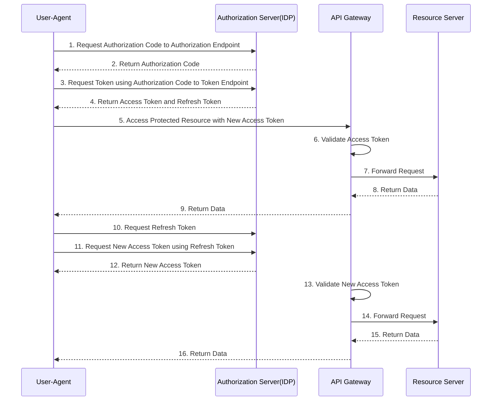
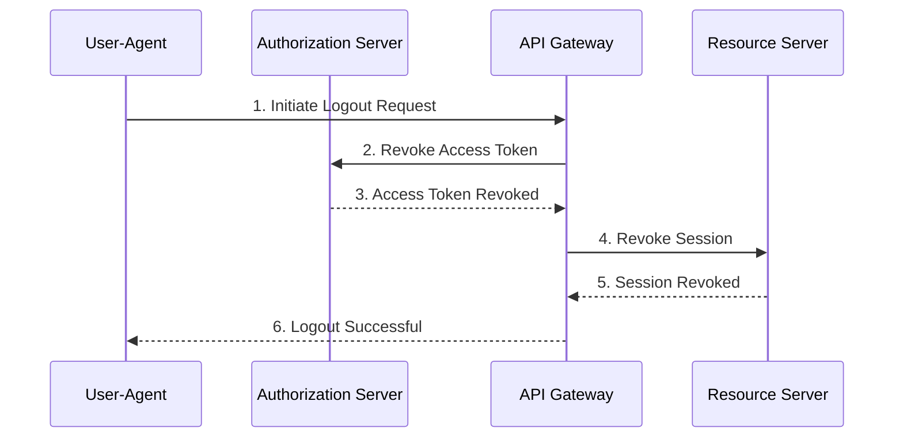

Autorization in Layers

1. Token Service - what scopes are services are allowed to be requested?
2. API Gateway - coarse grained check of scopes, token validity etc | coarse grained access control decision based on the claims in the token
3. Backend API - fine grained autorization of data(records, fields etc)released by API. Check claims, issuer, audience etc. | fine grained access control decision based on the token and the current request

Entitlement Management System 
- Open Policy Agent - OPA Engine
- Central place for autorization policy audit
- Cleaner application code and easier to maintain

- Authorization via the Entitlement Management System - OPA
- Called from PEP (policy Enforcement Point) - API Gateway or backend API 

https://www.openpolicyagent.org/

# Validate token locally in API Gateway

Applications calls *Authorization Endpoint <code>/oauth2/authorise</code>* to request an authorization code

Applications calls *Token Endpoint <code>/oauth2/token</code>* to request an OAuth token

# Logout scenario
Applications call this endpoint <code>/oauth2/logout</code> to log out the current user and end the user session.

| Grant Flow | Description | Use Case |
| --- | --- | --- |
| Authorization Code (response type code) front + back channel| It is the most used grant type to authorize the Client to access protected data from a Resource Server. | Used by the secure client to get access token on behalf of their end user from a web server or a 3rd Party Developer Apps. |
| implicit grant (response type token) front channel only| It is intended for user-based clients who can’t keep a client secret because all the application code and storage is easily accessible. | Used by the client that can’t protect a client secret/token, such as a mobile app or single page application. |
| Client Credentials (back channel only) | This grant type is non-interactive way for obtaining an application access token using the provided client id/secret keys, outside of the context of a user. | It is suitable for application-to-application(A2A) or Partner/B2B authentication, not on behalf of a user.|
| Resource Owner password Credentials (back channel only)| It uses the username and the password credentials of a Resource Owner (user) to authorize and access protected data from a Resource Server. | For logging in with a username and password (only for first-party apps) |

---

| **Grant / Mechanism** | **Description** | **Use Case** | **Gaps Addressed** | **Criteria to Choose (Guidance)** |
| --- | --- | --- | --- | --- |
| **Authorization Code (with PKCE)** | Most secure flow for user-based clients. Uses an authorization code exchanged for tokens via back channel. PKCE adds protection for public clients. | Web apps, mobile apps, SPAs acting on behalf of a user. | Added PKCE (critical for public clients), clarified security advantage. | Choose for apps acting on behalf of users, especially SPAs or mobile apps that cannot store secrets securely. |
| **Implicit Grant *(Deprecated)* ** | Tokens returned directly via front channel without code exchange. Vulnerable to token leakage. | Historically used by SPAs; should be avoided in favor of Authorization Code + PKCE. | Marked as deprecated per OAuth 2.1; recommend migration. | Do **not** choose; migrate to Authorization Code with PKCE. |
| **Client Credentials** | Non-interactive flow for confidential clients using client ID and secret or certificate. | Machine-to-machine (A2A), B2B integrations, service accounts. | Added note on certificate/private key JWT as stronger alternative. | Choose when no user context is needed and the client can securely store secrets. |
| **Resource Owner Password Credentials (ROPC) *(Discouraged)* ** | Uses user’s username/password directly to obtain tokens. High risk if credentials are exposed. | Only for legacy first-party apps where no better option exists. | Marked as discouraged; recommend replacing with Authorization Code flow. | Avoid unless absolutely necessary for legacy apps; prefer modern flows. |
| **Private Key JWT** | Client authenticates using a signed JWT instead of a shared secret. Stronger security via asymmetric keys. | High-security confidential clients, partner integrations. | Added as missing modern alternative for client authentication. | Choose when strong client authentication is required and key management is feasible. |
| **Device Authorization Flow** | Allows devices without browsers/keyboards to obtain tokens via user interaction on a separate device. | Smart TVs, IoT devices. | Added as missing flow for device-based scenarios. | Choose for devices with limited input capabilities (e.g., TVs, consoles). |
| **DPoP (Proof-of-Possession)** | Binds access tokens to a client’s private key to prevent token replay attacks. Requires a signed JWT for each request. | Securing API calls so stolen tokens cannot be reused without the private key. | Added as missing mechanism for token binding and replay protection. | Choose when token replay prevention is required for API calls; complements other flows. |

---
Reference
https://techcommunity.microsoft.com/t5/azure-paas-blog/protect-api-s-using-oauth-2-0-in-apim/ba-p/2309538

