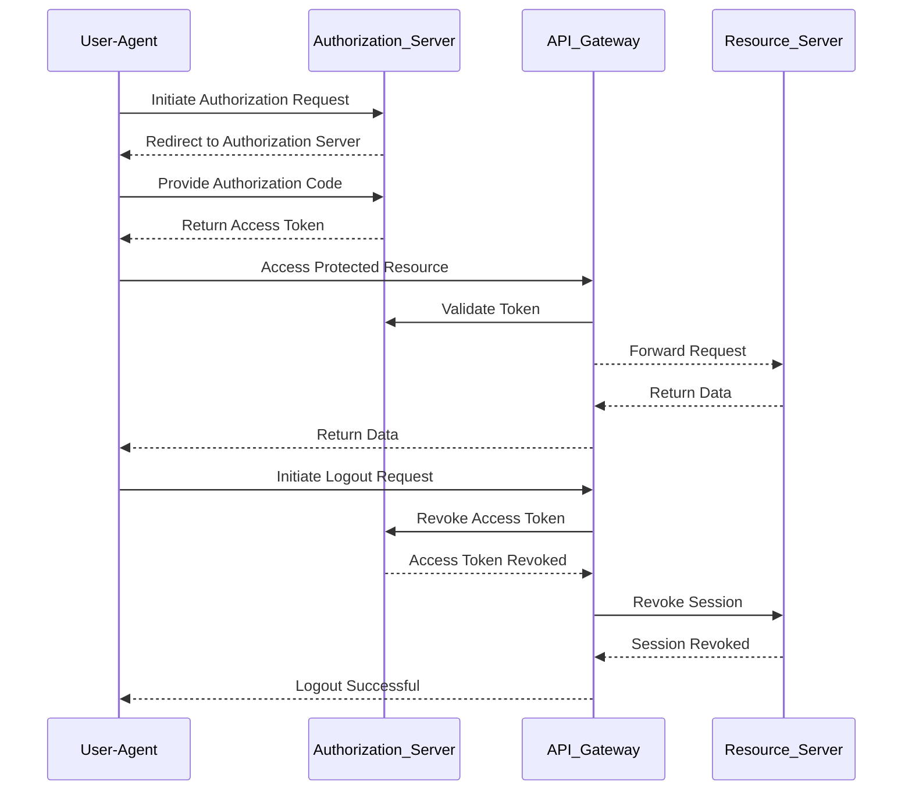
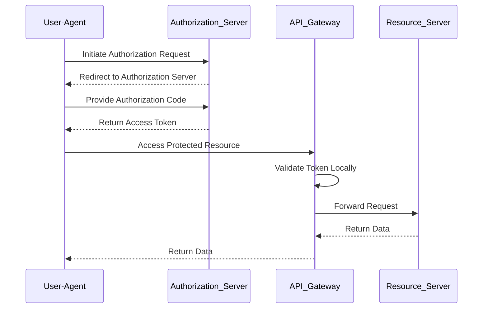
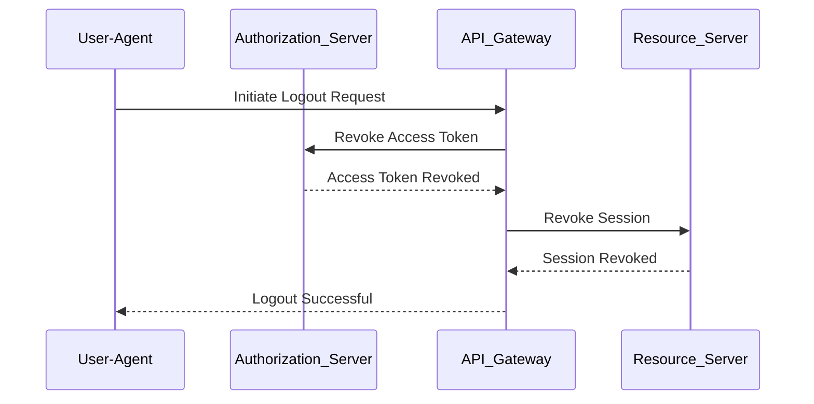

## Authorization Endpoint
Applications call this endpoint <code>/oauth2/authorise</code> to request an authorization code

## Token Endpoint
Applications call this endpoint <code>/oauth2/token</code> to request an OAuth token

# Validate token locally in API Gateway

# Validate token locally in API Gateway

# Logout scenario - Applications call this endpoint <code>/oauth2/logout</code> to log out the current user and end the user session.

