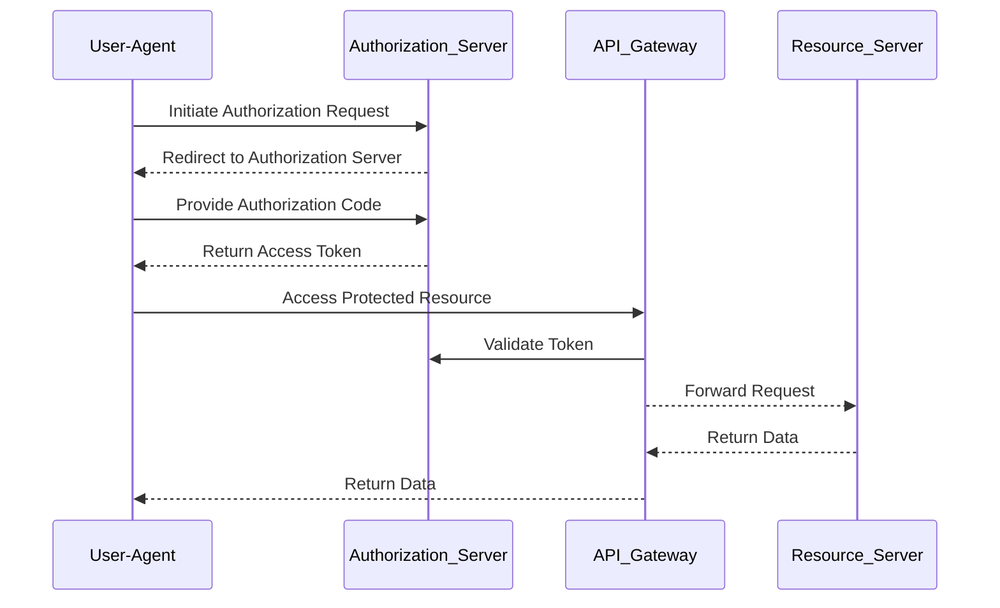

## Authorization Endpoint
Applications call this endpoint to request an authorization code
<code>/oauth2/authorise</code>

## Token Endpoint
Applications call this endpoint to request an OAuth token
<code>/oauth2/token</code>

