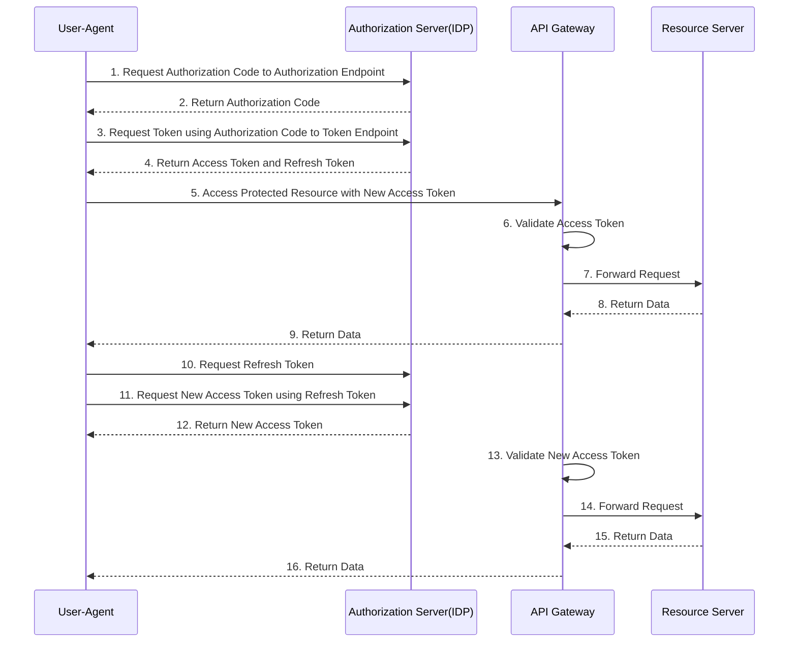
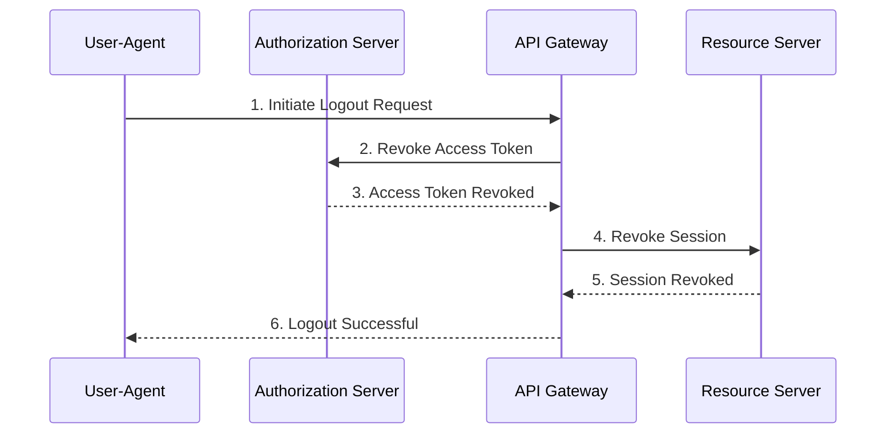

Autorization in Layers

1. Token Service - what scopes are services are allowed to be requested?
2. API Gateway - coarse grained check of scopes, token validity etc | coarse grained access control decision based on the claims in the token
3. Backend API - fine grained autorization of data(records, fields etc)released by API. Check claims, issuer, audience etc. | fine grained access control decision based on the token and the current request

Entitlement Management System 
- Open Policy Agent - OPA Engine
- Central place for autorization policy audit
- Cleaner application code and easier to maintain

- Authorization via the Entitlement Management System - OPA
- Called from PEP (policy Enforcement Point) - API Gateway or backend API 

https://www.openpolicyagent.org/

# Validate token locally in API Gateway

Applications calls *Authorization Endpoint <code>/oauth2/authorise</code>* to request an authorization code

Applications calls *Token Endpoint <code>/oauth2/token</code>* to request an OAuth token

# Logout scenario
Applications call this endpoint <code>/oauth2/logout</code> to log out the current user and end the user session.

| Grant Flow | Description | Use Case |
| --- | --- | --- |
| Authorization Code | It is the most used grant type to authorize the Client to access protected data from a Resource Server. | Used by the secure client to get access token on behalf of their end user from a web server or a 3rd Party Developer Apps. |
| Implicit | It is intended for user-based clients who can’t keep a client secret because all the application code and storage is easily accessible. | Used by the client that can’t protect a client secret/token, such as a mobile app or single page application. |
| Client Credentials | This grant type is non-interactive way for obtaining an application access token using the provided client id/secret keys, outside of the context of a user. | It is suitable for application-to-application(A2A) or Partner/B2B authentication, not on behalf of a user.|
| Resource Owner password Credentials | It uses the username and the password credentials of a Resource Owner (user) to authorize and access protected data from a Resource Server. | For logging in with a username and password (only for first-party apps) |

Reference
https://techcommunity.microsoft.com/t5/azure-paas-blog/protect-api-s-using-oauth-2-0-in-apim/ba-p/2309538

